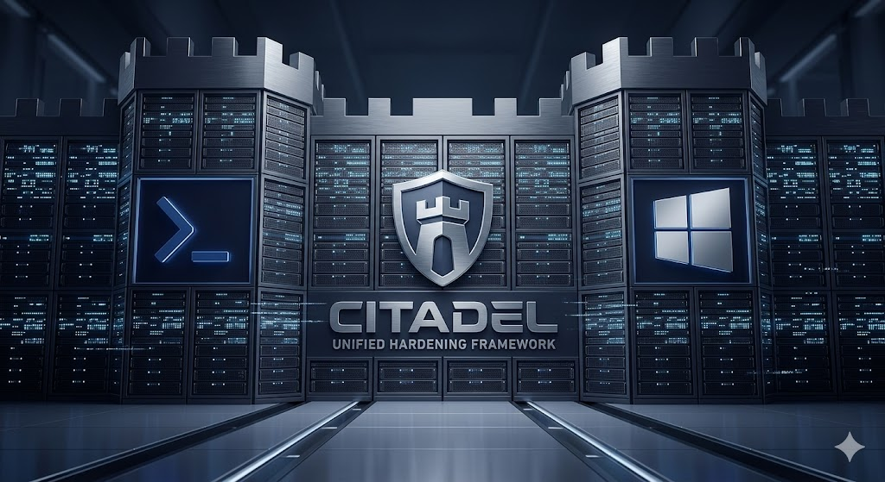

# CITADEL : Unified Hardening Framework



## Présentation
**CITADEL** est une suite d'outils d'ingénierie défensive automatisée conçue pour transformer des installations standards en environnements de haute sécurité. Ce projet regroupe deux frameworks monolithiques puissants pour durcir **Windows** et **Linux (RHEL 9-based)** selon les standards internationaux les plus stricts.

L'objectif est simple : offrir une **protection robuste**, **auditable** et **idempotente** pour les parcs hétérogènes.


## Architecture du Projet

Le dépôt est structuré par environnement pour faciliter le déploiement ciblé :

* **`Rocky 9/`** : Le framework Bash pour Rocky Linux 9, RHEL 9 et AlmaLinux 9.
* **`Windows/`** : Le framework PowerShell orienté MSSP pour Windows 10, 11 et Windows Server.

## Capacités Clés

### CITADEL pour Linux (Bash)
Framework de ~4000 lignes optimisé pour les environnements critiques.
* **Conformité** : Alignement CIS Benchmark L2, ANSSI BP-028 (High) et STIG.
* **Intégrité** : Immuabilité des fichiers système via `chattr +i` et wrapper d'édition sécurisé.
* **Réseau** : Firewall nftables dual-stack, DNS over TLS et port-knocking.
* **Surveillance** : Auditd (50+ règles), USBGuard, et Session Recording (tlog).
* **Modernité** : Sandboxing systemd et mitigations CPU (spectre/l1tf) via GRUB.

### CITADEL pour Windows (PowerShell)
Script monolithique de ~2600 lignes conçu pour la gestion de parc et le déploiement RMM/GPO.
* **Standards** : ANSSI BP-028, CIS Benchmark L2 et Microsoft Security Baselines.
* **Hygiène OS** : Désactivation des protocoles legacy (LLMNR, SMBv1), durcissement LSA et Credential Guard.
* **Protection** : Configuration complète des 16 règles Defender ASR et Exploit Protection (ASLR, DEP).
* **Traçabilité** : Logging triple canal (Event Log, CSV, Console) avec Run-ID unique pour chaque exécution.
* **Sécurité Opérationnelle** : Rollback natif du registre et création automatique de points de restauration.


## Comparaison des Profils

| Caractéristique | CITADEL (Linux) | CITADEL (Windows) |
| :--- | :--- | :--- |
| **Langage** | Bash 4.4+ | PowerShell 5.1+ |
| **Cible principale** | Serveurs de production | Postes de travail & Serveurs |
| **Mode Audit** | `--check-only` (60 points) | `-Mode Audit` (CSV complet) |
| **Idempotence** | Oui (State DB) | Oui (Lecture avant écriture) |
| **Rollback** | Via Snapshot LVM & State DB | Via Point de restauration & .reg |


## Utilisation Rapide

### Linux
```bash
sudo ./citadel.sh --compliance=anssi --enable-tlog
```

### Windows
```powershell
.\citadel.ps1 -Mode Enforce -Profile Workstation
```


## Licence & Responsabilité
Ce framework est destiné à un usage interne MSSP et aux administrateurs système expérimentés. Le durcissement système est une opération critique : testez toujours ces scripts en environnement de staging avant toute application en production.

**Project CITADEL** - *Because "Default" is not a security policy.*